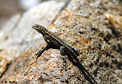

```{r setup, include=FALSE}
knitr::opts_chunk$set(echo = TRUE, message=FALSE, warning=FALSE)
```

# Preparations

Load the necessary libraries

```{r libraries, results='markdown', eval=TRUE}
library(rstanarm)   #for fitting models in STAN
library(brms)       #for fitting models in STAN
library(coda)       #for diagnostics
library(bayesplot)  #for diagnostics
library(ggmcmc)     #for MCMC diagnostics
library(DHARMa)     #for residual diagnostics
library(rstan)      #for interfacing with STAN
library(emmeans)    #for marginal means etc
library(broom)      #for tidying outputs
library(tidybayes)  #for more tidying outputs
library(ggeffects)  #for partial plots
library(tidyverse)  #for data wrangling etc
library(broom.mixed)#for summarising models
library(ggeffects)  #for partial effects plots
theme_set(theme_grey()) #put the default ggplot theme back
```

# Scenario

@Polis-1998-490 were intested in modelling the presence/absence of lizards (<i>Uta sp.</i>) against the perimeter to area ratio of 19 islands in the Gulf of California.

{width="200" height="137"}

Format of polis.csv data file

ISLAND       RATIO   PA
------------ ------- ----
Bota         15.41   1
Cabeza       5.63    1
Cerraja      25.92   1
Coronadito   15.17   0
..           ..      ..

------------ -----------------------------------------------------------------------------------------
**ISLAND**   Categorical listing of the name of the 19 islands used - variable not used in analysis.
**RATIO**    Ratio of perimeter to area of the island.
**PA**       Presence (1) or absence (0) of *Uta* lizards on island.
------------ -----------------------------------------------------------------------------------------


The aim of the analysis is to investigate the relationship between island parimeter to area ratio and the presence/absence of Uta lizards.

# Read in the data

```{r readData, results='markdown', eval=TRUE}
polis = read_csv('../data/polis.csv', trim_ws=TRUE)
glimpse(polis)
head(polis)
str(polis)
```

# Exploratory data analysis


Model formula:
$$
\begin{align}
y_i &\sim{} \mathcal{Bin}(n, p_i)\\
ln\left(\frac{p_i}{1-p_i}\right) &= \beta_0 + \beta_1 x_i\\
\beta_0 &\sim{} \mathcal{N}(0,10)\\
\beta_1 &\sim{} \mathcal{N}(0,1)\\
\end{align}
$$


# Fit the model {.tabset .tabset-faded}


# MCMC sampling diagnostics {.tabset .tabset-faded}


# Model validation {.tabset .tabset-faded}


# Partial effects plots {.tabset .tabset-faded}


# Model investigation {.tabset .tabset-faded}


# Further analyses {.tabset .tabset-faded}


# Summary figure {.tabset .tabset-faded}


# References
