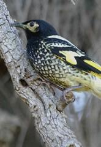

```{r setup, include=FALSE}
knitr::opts_chunk$set(echo = TRUE, message=FALSE, warning=FALSE)
```

# Preparations

Load the necessary libraries

```{r libraries, results='markdown', eval=TRUE}
library(car)
library(rstanarm)   #for fitting models in STAN
library(brms)       #for fitting models in STAN
library(coda)       #for diagnostics
library(bayesplot)  #for diagnostics
library(ggmcmc)     #for MCMC diagnostics
library(rstan)      #for interfacing with STAN
library(emmeans)    #for marginal means etc
library(DHARMa)     #for residual diagnostics
library(broom)      #for tidying outputs
library(tidybayes)  #for more tidying outputs
library(ggeffects)  #for partial plots
library(broom.mixed)#for summarising models
library(ggeffects)  #for partial effects plots
library(tidyverse)  #for data wrangling etc
```

# Scenario

@Loyn-1987-1987 modeled the abundance of forest birds with six predictor
variables (patch area, distance to nearest patch, distance to nearest
larger patch, grazing intensity, altitude and years since the patch had
been isolated).

{width="165" height="240"}

Format of loyn.csv data file

ABUND   DIST   LDIST   AREA   GRAZE   ALT   YR.ISOL
------- ------ ------- ------ ------- ----- ---------
..      ..     ..      ..     ..      ..    ..

------------- ------------------------------------------------------------------------------
**ABUND**     Abundance of forest birds in patch- response variable
**DIST**      Distance to nearest patch - predictor variable
**LDIST**     Distance to nearest larger patch - predictor variable
**AREA**      Size of the patch - predictor variable
**GRAZE**     Grazing intensity (1 to 5, representing light to heavy) - predictor variable
**ALT**       Altitude - predictor variable
**YR.ISOL**   Number of years since the patch was isolated - predictor variable
------------- ------------------------------------------------------------------------------

The aim of the analysis is to investigate the effects of a range of predictors on the abundance of forest birds.

# Read in the data

```{r readData, results='markdown', eval=TRUE}
loyn = read_csv('../data/loyn.csv', trim_ws=TRUE)
glimpse(loyn)
```


# Exploratory data analysis


Model formula:
$$
y_i \sim{} \mathcal{N}(\mu_i, \sigma^2)\\
log(\mu_i) = \boldsymbol{\beta} \bf{X_i}
$$

where $\boldsymbol{\beta}$ is a vector of effects parameters and $\bf{X}$ is a model matrix representing the additive effects of
the scaled versions of distance (ln), distance to the nearest large patch (ln), patch area (ln), grazing intensity, year of isolation and 
altitude on the abundance of forest birds.


# Fit the model {.tabset .tabset-faded}


# MCMC sampling diagnostics {.tabset .tabset-faded}


# Model validation {.tabset .tabset-faded}


# Partial effects plots {.tabset .tabset-faded}


# Model investigation {.tabset .tabset-faded}

