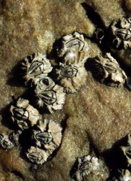

```{r setup, include=FALSE}
knitr::opts_chunk$set(echo = TRUE, message=FALSE, warning=FALSE)
```

# Preparations

Load the necessary libraries

```{r libraries, results='markdown', eval=TRUE}
library(rstanarm)   #for fitting models in STAN
library(brms)       #for fitting models in STAN
library(coda)       #for diagnostics
library(ggmcmc)     #for MCMC diagnostics
library(bayesplot)  #for diagnostics
library(rstan)      #for interfacing with STAN
library(DHARMa)     #for residual diagnostics
library(emmeans)    #for marginal means etc
library(broom)      #for tidying outputs
library(broom.mixed)
library(tidybayes)  #for more tidying outputs
library(ggeffects)  #for partial plots
library(tidyverse)  #for data wrangling etc
library(patchwork)
```


# Scenario

Here is a modified example from @Quinn-2002-2002. Day and Quinn
(1989) described an experiment that examined how rock surface type
affected the recruitment of barnacles to a rocky shore. The experiment
had a single factor, surface type, with 4 treatments or levels: algal
species 1 (ALG1), algal species 2 (ALG2), naturally bare surfaces (NB)
and artificially scraped bare surfaces (S). There were 5 replicate plots
for each surface type and the response (dependent) variable was the
number of newly recruited barnacles on each plot after 4 weeks.

{width="224" height="308"}

Format of day.csv data files

TREAT   BARNACLE
------- ----------
ALG1    27
..      ..
ALG2    24
..      ..
NB      9
..      ..
S       12
..      ..

-------------- ----------------------------------------------------------------------------------------------------------------------------------------------
**TREAT**      Categorical listing of surface types. ALG1 = algal species 1, ALG2 = algal species 2, NB = naturally bare surface, S = scraped bare surface.
**BARNACLE**   The number of newly recruited barnacles on each plot after 4 weeks.
-------------- ----------------------------------------------------------------------------------------------------------------------------------------------


# Read in the data

```{r readData, results='markdown', eval=TRUE}
day = read_csv('../data/day.csv', trim_ws=TRUE)
glimpse(day)
```

Start by declaring the categorical variables as factor.

```{r prepare, results='markdown', eval=TRUE, hidden=TRUE}
day = day %>% mutate(TREAT=factor(TREAT))
```

Model formula:
$$
\begin{align}
y_i &\sim{} \mathcal{Pois}(\lambda_i)\\
ln(\mu_i) &= \boldsymbol{\beta} \bf{X_i}\\
\beta_0 &\sim{} \mathcal{N}(0,10)\\
\beta_{1,2,3} &\sim{} \mathcal{N}(0,1)\\
\end{align}
$$

where $\boldsymbol{\beta}$ is a vector of effects parameters and $\bf{X}$ is a model matrix representing the intercept and treatment contrasts for the effects of Treatment on barnacle recruitment.

# Exploratory data analysis {.tabset .tabset-faded}


# Fit the model {.tabset .tabset-faded}


# MCMC sampling diagnostics {.tabset .tabset-faded}


# Model validation {.tabset .tabset-faded}


# Partial effects plots {.tabset .tabset-faded}


# Model investigation {.tabset .tabset-faded}


 
# Further investigations 


## Post-hoc test (Tukey's){.tabset .tabset-faded}


## Planned contrasts{.tabset .tabset-faded}

Define your own

Compare:

a) ALG1 vs ALG2
b) NB vs S
c) average of ALG1+ALG2 vs NB+S


# Summary Figure {.tabset .tabset-faded}


```{r fitModel, results='markdown', echo=FALSE,eval=FALSE, hidden=TRUE}
day.rstanarm <- stan_glm(BARNACLE ~ TREAT, data=day,
                      family=poisson(link='log'),
                      chains = 3,iter = 5000, warmup=2000, thin=5,
                      refresh=0)
prior_summary(day.rstanarm)

day.rstanarm <- stan_glm(BARNACLE ~ TREAT, data=day, family='poisson',
                      prior = normal(c(0,0,0), c(2.5,2.5,2.5)),
                      prior_intercept = normal(0,10),
                      chains = 3,iter = 2000, thin=2, refresh=0)
prior_summary(day.rstanarm)

plot(day.rstanarm,  'mcmc_trace')
plot(day.rstanarm,  'mcmc_acf_bar')
plot(day.rstanarm,  'mcmc_rhat_hist')
plot(day.rstanarm,  'mcmc_neff_hist')


preds <- posterior_predict(day.rstanarm,  nsamples=250,  summary=FALSE)
day.resids <- createDHARMa(simulatedResponse = t(preds),
                            observedResponse = day$BARNACLE,
                           fittedPredictedResponse = apply(preds, 2, median),
                           integerResponse = TRUE)
plot(day.resids)


#pp_check(day.rstanarm, x=as.numeric(day$TREAT),'intervals')


## Compare the proportion of zeros in the observed and expected data
#yrep = posterior_predict(day.rstan)
prop_zero <- function(y) mean(y == 0)
(prop_zero_test1 <- pp_check(day.rstanarm, plotfun = "stat", stat = "prop_zero"))
                                        # no zeros - so not zero inflated


day.rstanarmNB <- stan_glm(BARNACLE ~ TREAT, data=day,
                      family='neg_binomial_2',
                      chains = 3,iter = 5000, thin=5, warmup=2000, refresh=0)
preds <- posterior_predict(day.rstanarmNB,  nsamples=250,  summary=FALSE)
day.resids <- createDHARMa(simulatedResponse = t(preds),
                            observedResponse = day$BARNACLE,
                            fittedPredictedResponse = apply(preds, 2, median))
plot(day.resids)


day.rstanNB <- update(day.rstan, family = neg_binomial_2)
(loo.P=loo(day.rstan))
(loo.NB=loo(day.rstanNB))
compare_models(loo.P, loo.NB)

ggpredict(day.rstanarm, term='TREAT') %>% plot
ggpredict(day.rstanarm, ~TREAT) %>% plot
ggemmeans(day.rstanarm, ~TREAT) %>% plot


summary(day.rstanarm)
library(tidybayes)
tidyMCMC(day.rstanarm$stanfit, conf.int=TRUE,
         conf.method='HPDinterval', rhat=TRUE,ess=TRUE)


# Pairwise comparisons
library(emmeans)
## factor statements
emmeans(day.rstanarm, pairwise~TREAT, type='response')
## what about probabilities
day.em = emmeans(day.rstanarm, pairwise~TREAT, type='link')$contrasts %>%
    gather_emmeans_draws() %>%
    mutate(Fit=exp(.value))
day.em %>% head
day.em %>% group_by(contrast) %>%
    ggplot(aes(x=Fit)) +
    geom_histogram() +
    geom_vline(xintercept=1, color='red') + 
    facet_wrap(~contrast, scales='free')
day.em %>% group_by(contrast) %>% median_hdi()
# Probability of effect
day.em %>% group_by(contrast) %>% summarize(P=sum(Fit>1)/n())
##Probability of effect greater than 10%
day.em %>% group_by(contrast) %>% summarize(P=sum(Fit>1.1)/n())


##Planned contrasts
cmat<-cbind('Alg2_Alg1'=c(-1,1,0,0),
              'NB_S'=c(0,0,1,-1),
             'Alg_Bare'=c(0.5,0.5,-0.5,-0.5),
             'Alg_NB'=c(0.5,0.5,-1,0))
#crossprod(cmat)
emmeans(day.rstanarm, ~TREAT, contr=list(TREAT=cmat), type='link')
emmeans(day.rstanarm, ~TREAT, contr=list(TREAT=cmat), type='response')
day.em = emmeans(day.rstanarm, ~TREAT, contr=list(TREAT=cmat), type='link')$contrasts %>%
      gather_emmeans_draws() %>% mutate(Fit=exp(.value)) 
day.em %>% group_by(contrast) %>% mean_hdi()
# Probability of effect
day.em %>% group_by(contrast) %>% summarize(P=sum(Fit>1)/n())
##Probability of effect greater than 10%
day.em %>% group_by(contrast) %>% summarize(P=sum(Fit>1.5)/n())

hist(bayes_R2(day.rstanarmNB))

bayes_R2(day.rstanarm) %>% median_hdi
bayes_R2(day.rstanarmNB) %>% hist


## Summary plot
day.grid = with(day, list(TREAT=levels(TREAT)))
newdata = emmeans(day.rstanarm, ~TREAT, type='response') %>% as.data.frame
head(newdata)
ggplot(newdata, aes(y=rate, x=TREAT)) +
    geom_pointrange(aes(ymin=lower.HPD, ymax=upper.HPD))
```

                                           
```{r fitModel.brms, results='markdown', eval=FALSE, hidden=TRUE}
day.form <- bf(BARNACLE ~ TREAT,  family=poisson(link='log'))
get_prior(day.form,  data=day)
day.priors <- c(
  prior(normal(0, 10),  class='Intercept'),
  prior(normal(0, 2.5), class='b')
)
day.brms <- brm(day.form, data=day,
                prior=day.priors, 
                 chains=3,  iter=5000,  warmup=2000, thin=5,
                 refresh=0)

plot(day.brms)
mcmc_plot(day.brms,  type='acf_bar')
mcmc_plot(day.brms,  type='rhat_hist')
mcmc_plot(day.brms,  type='neff_hist')

preds <- posterior_predict(day.brms,  nsamples=250,  summary=FALSE)
day.resids <- createDHARMa(simulatedResponse = t(preds),
                            observedResponse = day$BARNACLE,
                           fittedPredictedResponse = apply(preds, 2, median),
                           integerResponse = TRUE)
plot(day.resids)

                                        #pp_check(day.brmsP, x=as.numeric(day$TREAT),'intervals')


ggpredict(day.brms, term='TREAT') %>% plot
ggpredict(day.brms, ~TREAT) %>% plot
ggemmeans(day.brms, ~TREAT) %>% plot

summary(day.brms)

tidyMCMC(day.brms$fit, conf.int=TRUE,
         conf.method='HPDinterval', rhat=TRUE,ess=TRUE)

# Pairwise comparisons
library(emmeans)
## factor statements
emmeans(day.brms, pairwise~TREAT, type='response')
## what about probabilities
day.em = emmeans(day.brms, pairwise~TREAT, type='link')$contrasts %>%
    gather_emmeans_draws() %>%
    mutate(Fit=exp(.value))
day.em %>% head
day.em %>% group_by(contrast) %>%
    ggplot(aes(x=Fit)) +
    geom_histogram() +
    geom_vline(xintercept=1, color='red') + 
    facet_wrap(~contrast, scales='free')
day.em %>% group_by(contrast) %>% median_hdi(.width=c(0.8, 0.95))

day.sum <- day.em %>%
  group_by(contrast) %>%
  median_hdci(.width=c(0.8, 0.95))
day.sum
ggplot(day.sum) +
  geom_hline(yintercept=1, linetype='dashed') +
  geom_pointrange(aes(x=contrast, y=Fit, ymin=Fit.lower, ymax=Fit.upper, size=factor(.width)),
                  show.legend = FALSE) +
  scale_size_manual(values=c(1, 0.5)) +
  coord_flip()

g1 <- ggplot(day.sum) +
  geom_hline(yintercept=1) +
  geom_pointrange(aes(x=contrast, y=Fit, ymin=Fit.lower, ymax=Fit.upper, size=factor(.width)), show.legend = FALSE) +
  scale_size_manual(values=c(1, 0.5)) +
  scale_y_continuous(trans=scales::log2_trans(),  breaks=c(0.5, 1, 2, 4)) +
  coord_flip()
g1
                                        # Probability of effect
day.em %>% group_by(contrast) %>% summarize(P=sum(.value>0)/n())
day.em %>% group_by(contrast) %>% summarize(P=sum(Fit>1)/n())
##Probability of effect greater than 10%
day.em %>% group_by(contrast) %>% summarize(P=sum(Fit>1.1)/n())

##Planned contrasts
cmat<-cbind('Alg2_Alg1'=c(-1,1,0,0),
              'NB_S'=c(0,0,1,-1),
             'Alg_Bare'=c(0.5,0.5,-0.5,-0.5),
             'Alg_NB'=c(0.5,0.5,-1,0))
#crossprod(cmat)
emmeans(day.brms, ~TREAT, contr=list(TREAT=cmat), type='link')
emmeans(day.brms, ~TREAT, contr=list(TREAT=cmat), type='response')
day.em = emmeans(day.brms, ~TREAT, contr=list(TREAT=cmat), type='link')$contrasts %>%
      gather_emmeans_draws() %>%
      mutate(Fit=exp(.value)) 
day.em %>% group_by(contrast) %>% median_hdci()
# Probability of effect
day.em %>% group_by(contrast) %>% summarize(P=sum(Fit>1)/n())
##Probability of effect greater than 10%
day.em %>% group_by(contrast) %>% summarize(P=sum(Fit>1.1)/n())

hist(bayes_R2(day.brms, summary=FALSE))

bayes_R2(day.brms, summary=FALSE) %>% median_hdi


## Summary plot
day.grid = with(day, list(TREAT=levels(TREAT)))
newdata = emmeans(day.brms, ~TREAT, type='response') %>% as.data.frame
head(newdata)
g2 <- ggplot(newdata, aes(y=rate, x=TREAT)) +
  geom_pointrange(aes(ymin=lower.HPD, ymax=upper.HPD))

library(patchwork)
g1 + g2
```

# References
