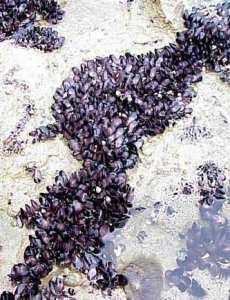

```{r setup, include=FALSE, warnings=FALSE, message=FALSE}
knitr::opts_chunk$set(echo = TRUE)
```

# Preparations

Load the necessary libraries

```{r libraries, results='markdown', eval=TRUE, message=FALSE, warning=FALSE}
library(rstanarm)   #for fitting models in STAN
library(brms)       #for fitting models in STAN
library(coda)       #for diagnostics
library(bayesplot)  #for diagnostics
library(rstan)      #for interfacing with STAN
library(DHARMa)     #for residual diagnostics
library(emmeans)    #for marginal means etc
library(broom)      #for tidying outputs
library(tidybayes)  #for more tidying outputs
library(ggeffects)  #for partial plots
library(tidyverse)  #for data wrangling etc
```

# Scenario

An ecologist studying a rocky shore at Phillip Island, in southeastern Australia, was interested in how
clumps of intertidal mussels are maintained [@Quinn-1988-137]. In particular, he wanted to know how densities of adult
mussels affected recruitment of young individuals from the plankton. As with most marine invertebrates,
recruitment is highly patchy in time, so he expected to find seasonal variation, and the interaction
between season and density - whether effects of adult mussel density vary across seasons - was the aspect
of most interest.

The data were collected from four seasons, and with two densities of adult mussels. The experiment
consisted of clumps of adult mussels attached to the rocks. These clumps were then brought back to the
laboratory, and the number of baby mussels recorded. There were 3-6 replicate clumps for each density
and season combination.

Format of quinn.csv data files

SEASON   DENSITY   RECRUITS   SQRTRECRUITS   GROUP
-------- --------- ---------- -------------- ------------
Spring   Low       15         3.87           SpringLow
..       ..        ..         ..             ..
Spring   High      11         3.32           SpringHigh
..       ..        ..         ..             ..
Summer   Low       21         4.58           SummerLow
..       ..        ..         ..             ..
Summer   High      34         5.83           SummerHigh
..       ..        ..         ..             ..
Autumn   Low       14         3.74           AutumnLow
..       ..        ..         ..             ..

------------------ --------------------------------------------------------------------------------------------
**SEASON**         Categorical listing of Season in which mussel clumps were collected ­ independent variable
**DENSITY**        Categorical listing of the density of mussels within mussel clump ­ independent variable
**RECRUITS**       The number of mussel recruits ­ response variable
**SQRTRECRUITS**   Square root transformation of RECRUITS - needed to meet the test assumptions
**GROUPS**         Categorical listing of Season/Density combinations - used for checking ANOVA assumptions
------------------ --------------------------------------------------------------------------------------------

{height="300"}

# Read in the data

```{r readData, results='markdown', eval=TRUE}
quinn = read_csv('../data/quinn.csv', trim_ws=TRUE)
glimpse(quinn)
summary(quinn)
```

```{r dataprep, results='markdown', eval=TRUE}
quinn = quinn %>% mutate(SEASON = factor(SEASON),
                         DENSITY = factor(DENSITY))
```

	
# Exploratory data analysis

Model formula:
$$
\begin{align}
y_i &\sim{} \mathcal{NB}(\lambda_i, \theta)\\
ln(\mu_i) &= \boldsymbol{\beta} \bf{X_i}\\
\beta_0 &\sim{} \mathcal{N}(0,10)\\
\beta_{1,2,3} &\sim{} \mathcal{N}(0,2.5)\\
\theta &\sim{} \mathcal{Exp}(1)
\end{align}
$$

where $\boldsymbol{\beta}$ is a vector of effects parameters and $\bf{X}$ is a model matrix representing the intercept and effects of season, density and their interaction on mussel recruitment.

# Fit the model


# Model validation

# Model investigation / hypothesis testing

# Predictions

# Summary figures

# References
