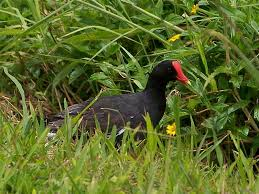

```{r setup, include=FALSE}
knitr::opts_chunk$set(echo = TRUE)
```

# Preparations

Load the necessary libraries

```{r libraries, results='markdown', eval=TRUE, warning=TRUE, message=FALSE}
library(mgcv)      #for GAMs
library(gratia)    #for GAM plots
library(emmeans)   #for marginal means etc
library(MuMIn)     #for model selection and AICc
library(tidyverse) #for data wrangling
library(DHARMa)    #for simulated residuals
library(performance) #for residual disagnostics
library(see)        # to visualize residual diagnostics
```
 
# Scenario

In a chapter on time series analysis, @Reed-2007-2007 presented Hawaiian longitudinal waterbird survey data.  These data comprise
winter counts of various species of stilts, coots and moorehen along with year and the previous seasons rainfall.  Here, we will
explore the temporal patterns in the Kauai Moorhen.

{width="251" height="290"}

Format of reed.csv data file

Year Stilt.Oahu Stilt.Maui Coot.Oahu Coot.Maui Moorhen.Kauai Rainfall
---- ---------- ---------- --------- --------- ------------- --------
1956 163        169        528       177       2             15.16
1957 272        190        338       273       NA            15.48
1958 549        159        449       256       2             16.26
1959 533        211        822       170       10            21.25
1960 NA         232        NA        188       4             10.94
1961 134        155        717       149       10           19.93

--------------    ---------------------------------------------------
**Year**          - a continuous predictor
**Stilt.Oahu**    - the abundance of the Oahu stilt
**Stilt.Maui**    - the abundance of the Maui stilt 
**Coot.Oahu**     - the abundance of the Oahu coot 
**Coot.Maui**     - the abundance of the Maui coot
**Moorhen.Kauai** - the abundance of the Kauai moorhen
**Rainfal**       - the number of centimeters (or inches) of rain
--------------    ---------------------------------------------------

# Read in the data

```{r readData, results='markdown', eval=TRUE}
reed = read_csv('../data/reed.csv', trim_ws=TRUE)
glimpse(reed)
```

# Exploratory data analysis

Model formula:
$$
y_i \sim{} \mathcal{Pois}(\lambda_i)\\
log(\lambda_i) =\beta_0 + f(Year_i) + f(Rainfall_i)
$$

where $\beta_0$ is the y-intercept. $f(Year)$ and $f(Rainfall)$ indicate the additive smoothing functions of Year and Rainfall respectively. 


# Fit the model


# Model validation


# Model investigation / hypothesis testing


# Predictions

# Summary figures


# References 
