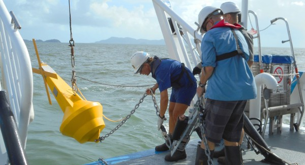

```{r setup, include=FALSE}
knitr::opts_chunk$set(echo = TRUE)
```

# Preparations

Load the necessary libraries

```{r libraries, results='markdown', eval=TRUE, warning=TRUE, message=FALSE}
library(mgcv)      #for GAMs
library(gratia)    #for GAM plots
library(emmeans)   #for marginal means etc
library(broom)     #for tidy output
library(MuMIn)     #for model selection and AICc
library(lubridate) #for processing dates
library(tidyverse) #for data wrangling
library(DHARMa)    #for residuals diagnostics
```
 
# Scenario

The Australian Institute of Marine Science (AIMS) have a long-term
inshore marine water quality monitoring program in which water samples
are collected and analysed from sites across the GBR numerous times 
per year.  The focus of this program is to report long-term condition and change
in water quality parameters.

{width="251" height="290"}

Format of aims.wq.csv data file

LATITUDE LONGITUDE reef.alias Water_Samples Region Subregion Season waterYear NOx
-------- --------- ---------- ------------- ------ --------- ------ --------- ---
-16.1    145.      Cape Trib… AIMS          Wet T… Barron D… Dry    2008      0.830
-16.1    145.      Cape Trib… AIMS          Wet T… Barron D… Wet    2008      0.100
-16.1    145.      Cape Trib… AIMS          Wet T… Barron D… Dry    2009      0.282
-16.1    145.      Cape Trib… AIMS          Wet T… Barron D… Wet    2009      1.27
-16.1    145.      Cape Trib… AIMS          Wet T… Barron D… Dry    2009      0.793
-16.1    145.      Cape Trib… AIMS          Wet T… Barron D… Dry    2010      0.380
\...     \...      \...       \...          \...   \...      \...   \...      \...

--------------     ---------------------------------------------------------------------
**LATITUDE**       - Latitudinal coordinate
**LONGITUDE**      - Longitudinal coordinate
**reef.alias**     - Internal AIMS reef name
**Water_Samples**  - Categorical label of who collected the data
**Region**         - The MMP region
**Subregion**      - The MMP subregion
**Season**         - A categorical listing of Wet or Dry
**waterYear**      - The water year (1st Oct - 30 Sept) to which the data are attached
**NOx**            - Nitrite and Nitrate
--------------     ---------------------------------------------------------------------

# Read in the data

```{r readData, results='markdown', eval=TRUE}
wq = read_csv('../data/aims.wq.csv', trim_ws=TRUE)
glimpse(wq)
```

```{r prepareData, results='markdown', eval=TRUE}
wq = wq %>% mutate(reef.alias=factor(reef.alias),
                   Region=factor(Region),
                   Subregion=factor(Subregion),
                   Season=factor(Season))
```


# Exploratory data analysis

Model formula:
$$
y_i \sim{} \mathcal{N}(\mu_i, \sigma^2)\\
\mu_i =\beta_0 + f(Date_i) + f(Month_i)
$$

where $\beta_0$ is the y-intercept. $f(Date)$ and $f(Month)$ indicate the additive smoothing functions of the long-term temporal trends and the annual seasonal trends respectively. 


# Simple model (Pandora only)


## Fit the model


## Model validation


## Model investigation / hypothesis testing

## Predictions

## Summary figures


# Mixed model (all reefs)

## Fit the model


 


## Model validation

## Model investigation / hypothesis testing


## Predictions

## Summary figures


