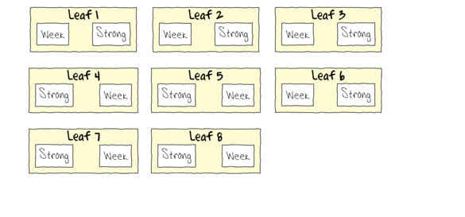

```{r setup, include=FALSE, warnings=FALSE, message=FALSE}
knitr::opts_chunk$set(echo = TRUE)
```

# Preparations

Load the necessary libraries

```{r libraries, results='markdown', eval=TRUE, message=FALSE, warning=FALSE}
library(car)       #for regression diagnostics
library(broom)     #for tidy output
library(broom.mixed)
library(ggfortify) #for model diagnostics
library(sjPlot)    #for outputs
library(knitr)     #for kable
library(effects)   #for partial effects plots
library(emmeans)   #for estimating marginal means
library(MASS)      #for glm.nb
library(MuMIn)     #for AICc
library(tidyverse) #for data wrangling
library(nlme)
library(lme4)      #for lmer
library(lmerTest)  #for satterthwaite p-values with lmer
#library(pbkrtest)  #for kenward-roger p-values with lmer
```

# Scenario

A plant pathologist wanted to examine the effects of two different strengths of tobacco virus on the number of lesions on tobacco leaves.  She knew from pilot studies that leaves were inherently very variable in response to the virus.  In an attempt to account for this leaf to leaf variability, both treatments were applied to each leaf.  Eight individual leaves were divided in half, with half of each leaf inoculated with weak strength virus and the other half inoculated with strong virus.  So the leaves were blocks and each treatment was represented once in each block.  A completely randomised design would have had 16 leaves, with 8 whole leaves randomly allocated to each treatment.  

{height="300"}



Format of tobacco.csv data files

LEAF   TREAT    NUMBER
------ -------- --------
1      Strong   35.898
1      Week     25.02
2      Strong   34.118
2      Week     23.167
3      Strong   35.702
3      Week     24.122
\...   \...     \...

------------ ----------------------------------------------------------------------------------------------------
**LEAF**     The blocking factor - Factor B
**TREAT**    Categorical representation of the strength of the tobacco virus - main factor of interest Factor A
**NUMBER**   Number of lesions on that part of the tobacco leaf - response variable
------------ ----------------------------------------------------------------------------------------------------


# Read in the data

```{r readData, results='markdown', eval=TRUE}
tobacco = read_csv('../data/tobacco.csv', trim_ws=TRUE)
glimpse(tobacco)
```


# Exploratory data analysis

Model formula:
$$
y_i \sim{} \mathcal{N}(\mu_i, \sigma^2)\\
\mu_i =\boldsymbol{\beta} \bf{X_i} + \boldsymbol{\gamma} \bf{Z_i}
$$

where $\boldsymbol{\beta}$ and $\boldsymbol{\gamma}$ are vectors of the fixed and random effects parameters respectively 
and $\bf{X}$ is the  model matrix representing the overall intercept and effects of the treatment on the number of lesions.
$\bf{Z}$ represents a cell means model matrix for the random intercepts associated with leaves.

# Fit the model (lme)
# Model validation (lme)
# Model investigation / hypothesis testing
# Predictions

# Summary figures

# Fit the model (lmer)

# Fit the model (glmmTMB)

# References
