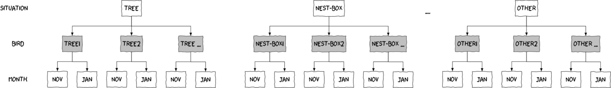
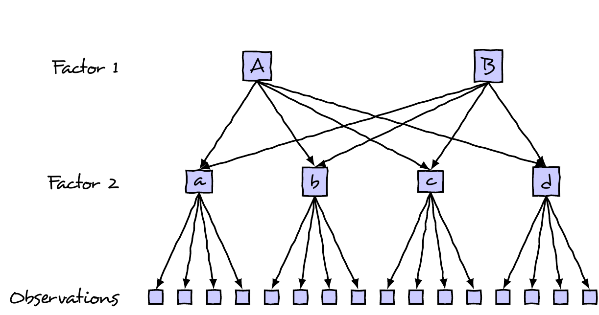

```{r setup, include=FALSE, warnings=FALSE, message=FALSE}
knitr::opts_chunk$set(echo = TRUE, message=FALSE, warning=FALSE,cache.lazy = FALSE, tidy='styler')
options(tinytex.engine = 'xelatex')
```
# Preparations

Load the necessary libraries

```{r libraries, results='markdown', eval=TRUE, message=FALSE, warning=FALSE}
library(car)       #for regression diagnostics
library(broom)     #for tidy output
library(ggfortify) #for model diagnostics
library(sjPlot)    #for outputs
library(knitr)     #for kable
library(effects)   #for partial effects plots
library(ggeffects) #for partial effects plots
library(emmeans)   #for estimating marginal means
library(MASS)      #for glm.nb
library(MuMIn)     #for AICc
library(tidyverse) #for data wrangling
library(broom.mixed)
library(nlme)      #for lme
library(lme4)      #for lmer
library(lmerTest)  #for Satterthwaite's p-values
library(glmmTMB)   #for glmmTMB
library(DHARMa)   #for residuals and diagnostics
library(performance) #for diagnostic plots
library(see)         #for diagnostic plots
```

# Scenario

{width="200" height="274"}



Format of starling\_full.RSV data files

SITUATION   MONTH   MASS   BIRD
----------- ------- ------ -----------
tree        Nov     78     tree1
..          ..      ..     ..
nest-box    Nov     78     nest-box1
..          ..      ..     ..
inside      Nov     79     inside1
..          ..      ..     ..
other       Nov     77     other1
..          ..      ..     ..
tree        Jan     85     tree1
..          ..      ..     ..

--------------- ------------------------------------------------------------------------------
**SITUATION**   Categorical listing of roosting situations (tree, nest-box, inside or other)
**MONTH**       Categorical listing of the month of sampling.
**MASS**        Mass (g) of starlings.
**BIRD**        Categorical listing of individual bird repeatedly sampled.
--------------- ------------------------------------------------------------------------------


<!-- {width="700"} -->

This is a split-plot (or repeated measures) design.  The individual birds are
the blocks, the Situation is the between block effect and the Month is the
within block effect.  Repeated measures analyses involve a within block effect
that represents time (in this case Month).  Since it is not possible to
randomise the order of time, repeated measures designs have the potential for
the residuals to be auto-correlated.  That is, rather than being independent,
residuals from observations that are closer in time, tend to be more similar
(correlated) than the residuals associated with observations that are further
apart in time.

That said, with only two time points, auto-correlation is not possible.

# Read in the data

```{r readData, results='markdown', eval=TRUE}
starling = read_csv('../data/starling_full.csv', trim_ws=TRUE)
glimpse(starling)
```

Lets prepare the data:


# Exploratory data analysis

Model formula:
$$
y_i \sim{} \mathcal{N}(\mu_i, \sigma^2)\\
\mu_i =\boldsymbol{\beta} \bf{X_i} + \boldsymbol{\gamma} \bf{Z_i}
$$

where $\boldsymbol{\beta}$ and $\boldsymbol{\gamma}$ are vectors of the fixed
and random effects parameters respectively and $\bf{X}$ is the model matrix
representing the overall intercept and effects of roosting situation and month
on starling mass.  $\bf{Z}$ represents a cell means model matrix for the random
intercepts associated with individual birds.

## Exploratory data analysis


# Fit the model {.tabset .tabset-faded}


# Model validation {.tabset .tabset-faded}


# Partial plots {.tabset .tabset-faded}

# Model investigation / hypothesis testing {.tabset .tabset-faded}


# Further analyses {.tabset .tabset-faded}


# Summary figures {.tabset .tabset-faded}


# References

