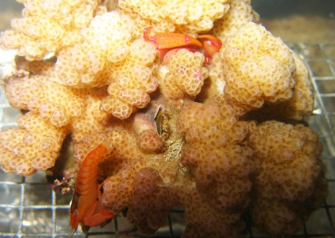

```{r setup, include=FALSE, warnings=FALSE, message=FALSE}
knitr::opts_chunk$set(echo = TRUE, message=FALSE, warning=FALSE,cache.lazy = FALSE, tidy='styler')
```

# Preparations

Load the necessary libraries

```{r libraries, results='markdown', eval=TRUE, message=FALSE, warning=FALSE}
library(car)       #for regression diagnostics
library(broom)     #for tidy output
library(broom.mixed)
library(ggfortify) #for model diagnostics
library(sjPlot)    #for outputs
library(knitr)     #for kable
library(effects)   #for partial effects plots
library(ggeffects) #for effects plots in ggplot
library(emmeans)   #for estimating marginal means
library(MASS)      #for glm.nb
library(MuMIn)     #for AICc
library(tidyverse) #for data wrangling
library(DHARMa)   #for residuals and diagnostics
library(nlme)     #for lme
library(lme4)      #for glmer
library(glmmTMB)    #for glmmTMB
library(performance) #for diagnostic plots
library(see)         #for diagnostic plots
```

# Scenario

{width="400" height="284"}

To investigate synergistic coral defence by mutualist crustaceans,
@Mckeon-2012-1095 conducted an aquaria experiment in which colonies of a coral
species were placed in a tank along with a predatory sea star and one of four
symbiont combinations:

- no symbiont,
- a crab symbiont
- a shrimp symbiont
- both a crab and shrimp symbiont.

The experiments were conducted in a large octagonal flow-through seawater tank
that was partitioned into eight sections, which thereby permitted two of each of
the four symbiont combinations to be observed concurrently. The tank was left
overnight and in the morning, the presence of feeding scars on each coral colony
was scored as evidence of predation.  The experiments were repeated ten times,
each time with fresh coral colonies, sea stars and symbiont.

The ten experimental times represent blocks (random effects) within which the
symbiont type (fixed effect) are nested.

# Read in the data

```{r readData, results='markdown', eval=TRUE}
mckeon = read_csv('../data/mckeon.csv', trim_ws=TRUE)
glimpse(mckeon)
```


# Exploratory data analysis {.tabset .tabset-faded}

Model formula:
$$
y_i \sim{} \mathcal{N}(n, p_i)\\
ln\left(\frac{p_i}{1-p_1}\right) =\boldsymbol{\beta} \bf{X_i} + \boldsymbol{\gamma} \bf{Z_i}
$$

where $\boldsymbol{\beta}$ and $\boldsymbol{\gamma}$ are vectors of the fixed and random effects parameters respectively 
and $\bf{X}$ is the model matrix representing the overall intercept and effects of symbionts on the probability of the colony experiencing predation.
$\bf{Z}$ represents a cell means model matrix for the random intercepts associated with individual coral colonies.


# Fit the model {.tabset .tabset-faced}


# Model validation {.tabset .tabset-faded}


# Partial plots {.tabset .tabset-faded}


# Model investigation / hypothesis testing {.tabset .tabset-faded}


# Further analyses {.tabset .tabset-faded}


# Summary figure {.tabset .tabset-faded}


# References
