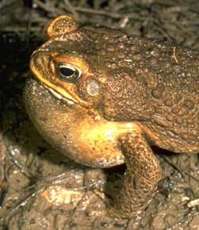

```{r setup, include=FALSE, warnings=FALSE, message=FALSE}
knitr::opts_chunk$set(echo = TRUE, message=FALSE, warning=FALSE,cache.lazy = FALSE, tidy='styler')
```

# Preparations

Load the necessary libraries

```{r libraries, results='markdown', eval=TRUE, message=FALSE, warning=FALSE}
library(car)       #for regression diagnostics
library(broom)     #for tidy output
library(broom.mixed) #for tidy output
library(ggfortify) #for model diagnostics
library(sjPlot)    #for outputs
library(knitr)     #for kable
library(effects)   #for partial effects plots
library(ggeffects) #for effects plots in ggplot
library(emmeans)   #for estimating marginal means
library(MASS)      #for glm.nb
library(MuMIn)     #for AICc
library(tidyverse) #for data wrangling
library(DHARMa)    #for assessing dispersion etc
library(lme4)      #for lmer
library(lmerTest)  #for degrees of freedom in lmer
library(glmmTMB)    #for glmmTMB
library(performance) #for diagnostic plots
library(see)         #for diagnostic plots
```

# Scenario

In an honours thesis from (1992), Mullens was investigating the ways that cane
toads ( Bufo marinus ) respond to conditions of hypoxia. Toads show two
different kinds of breathing patterns, lung or buccal, requiring them to be
treated separately in the experiment. Her aim was to expose toads to a range of
O~2~ concentrations, and record their breathing patterns, including parameters
such as the expired volume for individual breaths. It was desirable to have
around 8 replicates to compare the responses of the two breathing types, and the
complication is that animals are expensive, and different individuals are likely
to have different O~2~ profiles (leading to possibly reduced power). There are
two main design options for this experiment;

-   One animal per O~2~ treatment, 8 concentrations, 2 breathing types.  With 8
    replicates the experiment would require 128 animals, but that this could be
    analysed as a completely randomised design
-   One O~2~ profile per animal, so that each animal would be used 8 times and
    only 16 animals are required (8 lung and 8 buccal breathers)

Mullens decided to use the second option so as to reduce the number of animals
required (on financial and ethical grounds). By selecting this option, she did
not have a set of independent measurements for each oxygen concentration, by
repeated measurements on each animal across the 8 oxygen concentrations.

{width="251" height="290"}

Format of mullens.csv data file

BREATH   TOAD   O2LEVEL   FREQBUC   SFREQBUC
-------- ------ --------- --------- ----------
lung     a      0         10.6      3.256
lung     a      5         18.8      4.336
lung     a      10        17.4      4.171
lung     a      15        16.6      4.074
\...     \...   \...      \...      \...

-------------- ---------------------------------------------------------------------------------------------------------------------------------------------------------------------------------------------------------------------------------------------------------------------------------------------------------------------------------------------------
**BREATH**     Categorical listing of the breathing type treatment (buccal = buccal breathing toads, lung = lung breathing toads). This is the between subjects (plots) effect and applies to the whole toads (since a single toad can only be one breathing type - either lung or buccal). Equivalent to Factor A (between plots effect) in a split-plot design
**TOAD**       These are the subjects (equivalent to the plots in a split-plot design: Factor B). The letters in this variable represent the labels given to each individual toad.
**O2LEVEL**    0 through to 50 represent the the different oxygen concentrations (0% to 50%). The different oxygen concentrations are equivalent to the within plot effects in a split-plot (Factor C).
**FREQBUC**    The frequency of buccal breathing - the response variable
**SFREQBUC**   Square root transformed frequency of buccal breathing - the response variable
-------------- ---------------------------------------------------------------------------------------------------------------------------------------------------------------------------------------------------------------------------------------------------------------------------------------------------------------------------------------------------

# Read in the data

```{r readData, results='markdown', eval=TRUE}
mullens <- read_csv('../data/mullens.csv', trim_ws = TRUE)
mullens %>% glimpse()
```


# Exploratory data analysis

Model formula:
$$
y_i \sim{} \mathcal{Pois}(\lambda_i)\\
ln(\lambda_i) =\boldsymbol{\beta} \bf{X_i} + \boldsymbol{\gamma} \bf{Z_i}
$$

where $\boldsymbol{\beta}$ and $\boldsymbol{\gamma}$ are vectors of the fixed
and random effects parameters respectively and $\bf{X}$ is the model matrix
representing the overall intercept and effects of copper, distance and their
interaction on the number of number of worms.  Area of the place segment was
also incorporated as an offset.  $\bf{Z}$ represents a cell means model matrix
for the random intercepts associated with individual plates.


# Fit the model {.tabset .tabset-faded}


# Model validation {.tabset .tabset-faded}


# Model investigation / hypothesis testing {.tabset .tabset-faded}


# Further analyses {.tabset .tabset-faded}


# Summary figures {.tabset .tabset-faded}


# References
