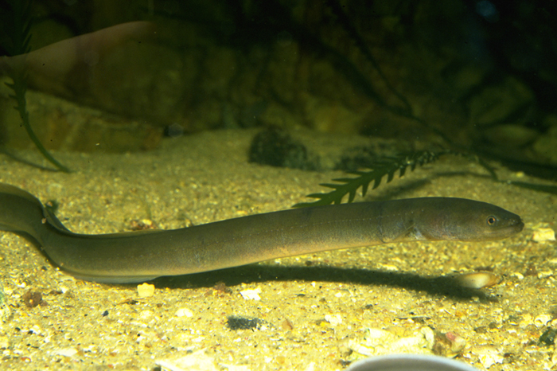

```{r setup, include=FALSE}
knitr::opts_chunk$set(echo = TRUE, message=FALSE, warning=FALSE)
```

# Preparations

Load the necessary libraries

```{r libraries, results='markdown', eval=TRUE}
library(gbm)         #for gradient boosted models
library(car)
library(dismo)
library(pdp)
library(ggfortify)
library(randomForest)
library(tidyverse)
library(patchwork)
library(stars)
```

# Scenario

@Leathwick-2008-1481 compiled capture data of short-finned eels (_Anguilla
australis) within New Zealand freshwater streams to explore the distribution of
the eels for conservation purposes. The goal was to be able to model the
presence/absence of the eels against a range of environmental characteristics so
as to predict their more broader occurances and identify which predictors are
the most important in the predictions.

{width="350" height="233"}

Format of leathwick.csv data file

Site  Angaus  SegSumT SegTSeas SegLowFlow ... 
----- ------- ------- -------- ---------- -----
1     0       16.0       -0.10  1.036     ...
2     1       18.7        1.51  1.003     ...
3     0       18.3        0.37  1.001     ...
4     0       16.7       -3.80  1.000     ...
5     1       17.2        0.33  1.005     ...
6     0       15.1        1.83  1.015     ...
..    ..      ..          ..    ..        ...

-------------- ----------------------------------------------------------------------------------------------------------------------------------------------
**Site**       Unique label for each site.
**Angaus**     Presence (1) or absence (0) of _Anguilla australis_ eels
**SegSumT**    Summer air temperature (degrees celcius) at the river segment
               scale
**SegTSeas**   Winter temperature normalised to January temperature at the river
               segment scale
**SegLowFlow** Forth root transformed low flow rate at the river segment scale
**DSDist**     Distance to coast (km) (a downstream predictor)
**DSDam**      Presence of known downsteam obstructions (a downstream predictor)
**DSMaxSlope** Maximum downstream slope (a downstream predictor)
**USAvgT**     Upstream average tempeture (normalised for the river segment)
**USRainDays** Number of rainy days recorded in the upstream catchment
**USSlope**    Slope of the river upstream
**USNative**   Percentage of the upstream riparian vegetation that is native
**Method**     Method used to capture the eels (categorical predictor)
**LocSed**     Weighted average of the proportional cover of bed sediment
               (1=mud, 2=sand, 3=fine gravel, 4=course gravel, 5=cobble, 6=boulder, 7=bedrock)
-------------- ----------------------------------------------------------------------------------------------------------------------------------------------


# Read in the data

```{r readData, results='markdown', eval=TRUE}
leathwick = read_csv('../data/leathwick.csv', trim_ws=TRUE)
glimpse(leathwick)
```

```{r preparation, results='markdown', eval=TRUE, hidden=TRUE}
leathwick <- leathwick %>%
    mutate(Method=factor(Method),
           LocSed = as.numeric(LocSed)) %>% 
    ## LocSed=factor(LocSed)) %>%
    as.data.frame
```


```{r readData1, results='markdown', eval=TRUE}
leathwick_test = read_csv('../data/leathwick_test.csv', trim_ws=TRUE)
glimpse(leathwick_test)
```

```{r preparation1, results='markdown', eval=TRUE, hidden=TRUE}
leathwick_test = leathwick_test %>%
    mutate(Method=factor(Method), 
           LocSed=as.numeric(LocSed)) %>%
  as.data.frame()
```

# Exploratory data analysis

```{r EDA, results='markdown', eval=TRUE, hidden=TRUE, fig.width=15, fig.height=15}
scatterplotMatrix(~Angaus+SegSumT+SegTSeas+SegLowFlow+DSDist+DSMaxSlope+DSDam+
                    USAvgT+USRainDays+USSlope+USNative+Method+LocSed,  data=leathwick,
                  diagonal=list(method='boxplot'))
```

# Fit the model


# Partial plots


# Assessing accuracy


## Plot spatial distribution of eels

```{r name, results='markdown', eval=TRUE, hidden=TRUE, fig.width=15, fig.height=15}
data(Anguilla_grids)
leathwick.grid = Anguilla_grids
glimpse(leathwick.grid)

plot(leathwick.grid)

Method <- factor('electric', levels=levels(leathwick$Method))
Method = as.data.frame(Method)

fit <- predict(leathwick.grid, leathwick.gbm,  const=Method,
               n.trees=best.iter,  type='response')
#fit <- mask(fit,  raster(leathwick.grid, 1))
library(stars)
fit= stars::st_as_stars(fit)


ggplot() +
  geom_stars(data=fit) +
  scale_fill_gradient(low='red', high='green', 'Probability\nof occurrance', na.value=NA) +
  coord_sf(expand=FALSE) +
  theme_bw()
```

# References
